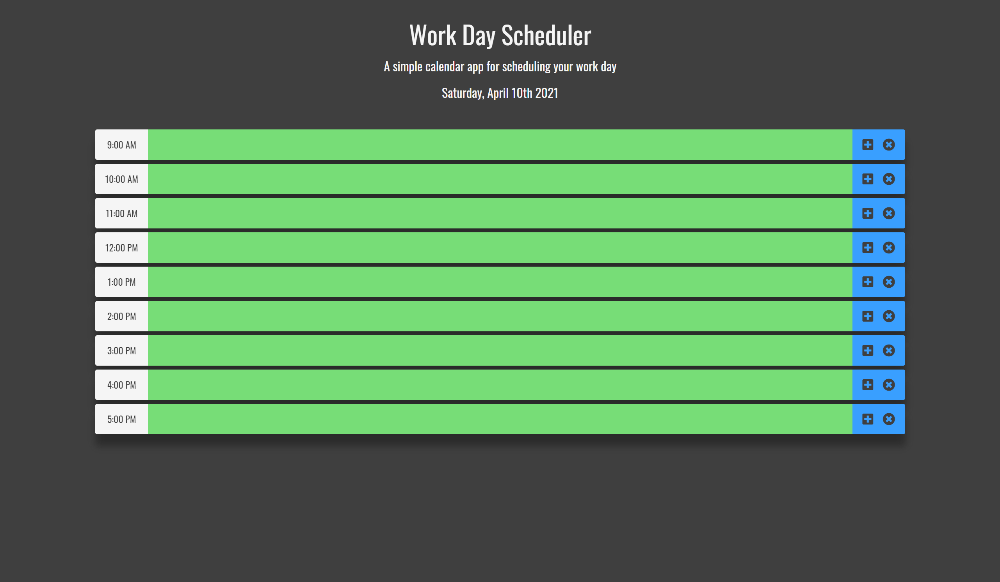

# Schedule Planner

## Description

This is a regular business hour day planner to save tasks to each hour. The planner's background color will change grey to represent past time, red to represent current time, and green to represent future time. The planner will remain grey until 12:00 AM, and will then turn green starting the new day. You can start to record your day at 9:00 AM in which the current hour will turn red to remind what tasks are due.

The application was created using HTML, CSS, Bootstrap 5, and Javascript. The application uses jQuery, and Moment JS to track time as well.

## Usage

Write your desired task within the hour. Use the plus icon to save your task, and the circular X icon to delete the task. Your tasks will be saved to local storage until you delete them.

[https://dbernard87.github.io/schedule-planner/]

## Features

- 9 to 5 day planner for regular business hours.
- Background color will change depending on past, present, or future time.
- Javascript, CSS, and HTML.
- Bootstrap 5
- jQuery 
- Moment JS

## Credits

- David Bernard : [https://github.com/dbernard87]
- Icons from Font Awesome : [https://fontawesome.com/]
- Stack Overflow : [https://stackoverflow.com/]
- w3schools : [https://www.w3schools.com/]
- MDN Documentation : [https://developer.mozilla.org/en-US/]